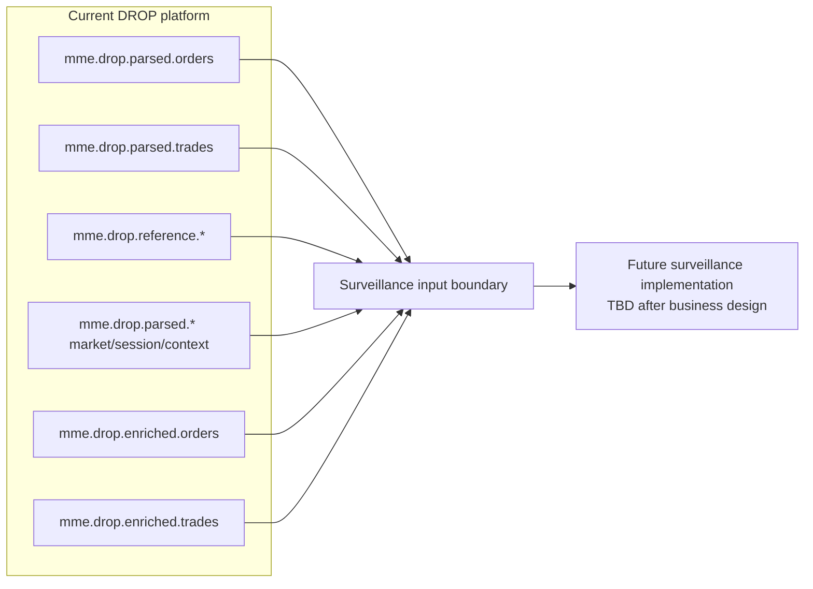

# Surveillance Data Interface Boundary

> [!IMPORTANT]
> This note defines **what data the current DROP platform can expose to the future surveillance system**. It deliberately does **not** define Orleans grains, rules-engine design, AI models, service decomposition, or any other surveillance implementation choice.

## Boundary diagram

## Data layers available today

### 1. Raw business-event layer - parsed topics

- Full order lifecycle events: `mme.drop.parsed.orders`.
- Trade-side events: `mme.drop.parsed.trades`.
- Rejected orders and off-exchange trades.
- RFQ / RFQ response / indicative-quote flows.
- BBO, equilibrium price, price limits, reference price, index price, away-market BBO and delayed last match price.
- Circuit-breaker, session-change, business-date and market-announcement context.

### 2. Reference identity/instrument layer

`mme.drop.reference.*` topics provide assets, order books, participants, actors, accounts, account types/groups, investors and custodians.

### 3. Enriched convenience layer

- `mme.drop.enriched.orders`
- `mme.drop.enriched.trades`

These are derived from parsed events plus Redis reference data. They are convenient but should not be treated as the only evidence source because enrichment has known degradation/duplicate windows.

### 4. Persistence layer

Oracle and PostgreSQL retain current DROP outputs for replay/investigation purposes, but the live surveillance input should be defined separately from database persistence concerns.

## Recommended business requirement for the future interface

When the new surveillance implementation is designed, its input contract should explicitly state which of the above topic groups are authoritative evidence, which are derived convenience views, and how event identity / ordering / replay is preserved. That is a future design decision, not assumed here.
