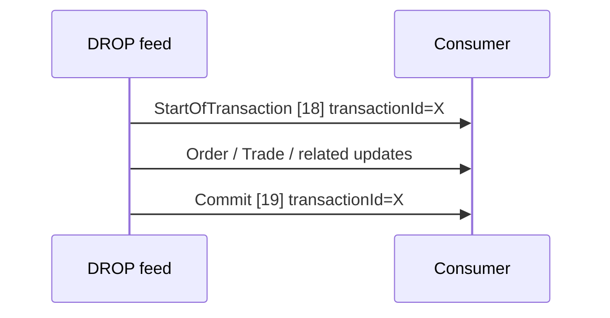
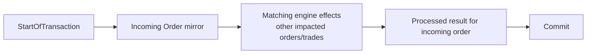

# Order and Transaction Lifecycle

## Matching-round boundaries

Orders and trades are grouped into matching rounds (commits):

`Commit` also carries transaction time, gateway receive time and processing duration.

## Incoming order behavior from the official appendix

The specification states that an incoming order **always results in two Order messages**:

1. **Incoming mirror** - mirrors the incoming order before matching-engine processing.
2. **Processed result** - mirrors the order after processing and indicates whether it matched, entered the book, etc.

It also states that within the transaction, the incoming-order message is sent before other Order messages for orders affected by that transaction.

## Key order lifecycle fields

- `timeCreated`, `timeChanged`
- `orderId`, `previousOrderId`, `clientOrderId`, `orderToken`
- `side`, `price`, `originalQuantity`, `orderQuantity`, `leavesQuantity`, `matchedQuantity`
- `timeInForce`, `orderType`, `initialOrderType`, `exchangeOrderType`, `orderCategory`
- `changeReason`
- `orderStatus`, `orderStatusBefore`
- `orderBookPosition`
- `selfMatchPreventionKey`
- `participantId`, `actorId`, `submitterId`, `onBehalfOfSubmitterId`, `account`, `custodian`

## Official examples

The appendix includes examples for:

- limit order entered and added to the order book;
- market order entered and partly matched but not added to the order book;
- limit order entered and fully matched.

Source: official specification pp. 51-52.
