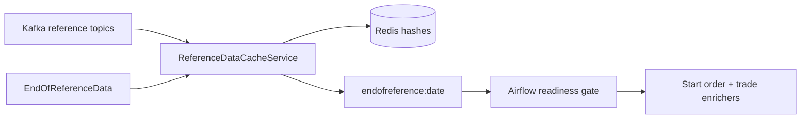

# Redis State and Reference Cache

## Current key ownership

| Key pattern | Type | Writer | Purpose / readers |
|---|---|---|---|
| `mme.drop.ingestor:{instance}:next_mme_sequence_number` | String | Ingestor / Airflow reset | Next EGX replay checkpoint |
| `mme.drop.ingestor:{instance}:health` | Hash + TTL | Ingestor | Airflow runtime-health monitoring |
| `asset:{id}` | Hash | ReferenceDataCacheService | Asset lookups by enrichers |
| `orderbook:{id}` | Hash | ReferenceDataCacheService | Order-book lookups by enrichers |
| `participant:{id}` | Hash | ReferenceDataCacheService | Participant name/context |
| `actor:{id}` | Hash | ReferenceDataCacheService | Actor name/context |
| `account:{id}` and secondary `account:{name}` | Hash | ReferenceDataCacheService | Account lookup |
| `accountgroup:{id}` | Hash | ReferenceDataCacheService | Account-group reference |
| `accounttype:{id}` | Hash | ReferenceDataCacheService | Account-type reference |
| `investor:{id}` | Hash | ReferenceDataCacheService | Investor reference |
| `custodian:{id}` and secondary `custodian:{name}` | Hash | ReferenceDataCacheService | Custodian lookup |
| `corporateaction:{id}` | Hash | ReferenceDataCacheService | Corporate-action reference |
| `exchangerate:{currency}` | Hash | ReferenceDataCacheService | Exchange-rate reference |
| `system:initialbusinessdate` | Hash | ReferenceDataCacheService | Initial business date |
| `accountpos:{asset}:{participant}:{account}:{investor}` | Hash | ReferenceDataCacheService | Position updates |
| `endofreference:{yyyyMMdd}` | String | ReferenceDataCacheService | Reference-cache readiness gate for Airflow |
| `pending:trade:{lifecycle}:{buy|sell}` | List | TradeEnrichmentService | Unmatched trade-side matching state |

## Current reference warm-up

Reference updates can occur after initial EORD; the cache continues consuming them.
