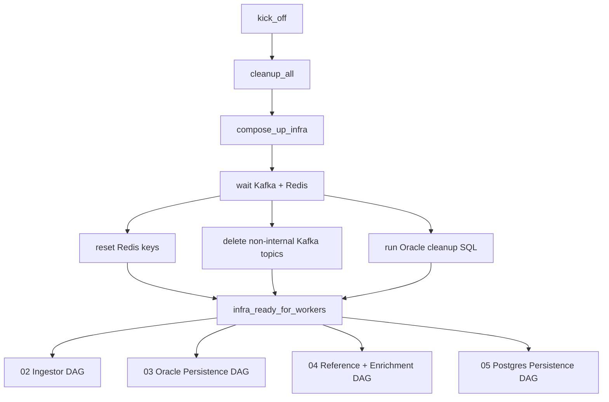

# Airflow Orchestration

Airflow uses `CeleryExecutor` and acts as the current control plane for daily DROP startup.

## Controller DAG

`mme_01_core_infra_pipeline` runs daily at **07:00 Cairo**, `max_active_runs=1`, `catchup=False`.

Child DAGs are triggered asynchronously (`wait_for_completion=False`).

## Critical startup gates

### Ingestors

Airflow checks `mme.drop.ingestor:{instance}:health` and the `airflow_ready` field for `trades-only`, `orders-only`, and `rest-messages`. Documented unhealthy states include `login_rejected`, `connected_no_messages`, and `feed_idle`.

### Oracle structured persistence

Structured reference persistence is staged after EndOfReferenceData reaches Oracle, followed by lag-zero and table-population gates for assets, order books and remaining reference tables. Transaction/summary struct services start only after reference gates.

### Reference + enrichment

Default path starts `ReferenceDataCacheService` first, waits for `endofreference:*` in Redis, applies a settle delay, then starts `TradeEnrichmentService` and `OrderEnrichmentService`.

### PostgreSQL

Checks DB reachability, truncates configured tables, then starts `PostgresPersistence`.
