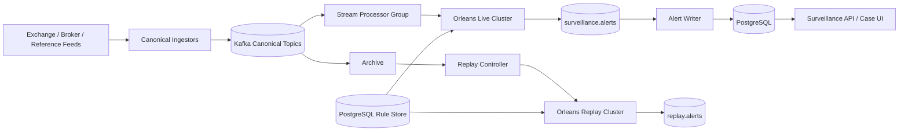

# Recommended Architecture

## Recommendation

Use a **deterministic event-driven core** with two separate Orleans clusters in production:

- **Live cluster:** processes current market activity and emits surveillance alerts.
- **Replay cluster:** replays historical sessions, backtests rules, recalibrates thresholds and reproduces incidents without consuming live capacity.

Both clusters run the same surveillance code but use different `ClusterId`, Kafka consumer groups and output topics.

## Why this shape

### Keep market state inside Orleans

The order book, participant windows, auction state, positions and relationship state are naturally keyed. A grain gives one logical owner for each key and serializes changes to that state.

### Keep raw history outside Orleans

Do **not** keep a day's entire raw order stream in grain state. Kafka plus archival storage owns the immutable history. Grains keep only the live state and bounded windows needed to make a current decision.

### Keep rules close to the state

Run rule evaluation inside the Orleans cluster using local stateless-worker grains. This avoids a network call to a centralized rules microservice for every candidate event.

### Persist alerts asynchronously

The live path publishes an immutable `AlertCandidate`/`AlertCreated` event to Kafka. A separate writer persists it. A slow database should not stop order-book processing.

### Separate live and replay

Replay can be CPU-heavy and bursty. Do not let a six-month backtest compete with the closing auction on the live cluster.

## Non-negotiable implementation rules

- No global `SurveillanceGrain` handling all activity.
- No grain-per-rule and no grain-per-detector.
- No database write for every market order update.
- No evaluation of all 540 case rules for every event.
- No `lock`, `.Result`, `.Wait()` or blocking I/O inside grains.
- Default stateful grains remain non-reentrant.
- Every input event must have an idempotency identity and source sequence where available.
- Every alert stores rule version, detector version, data version and evidence.
- Dynamic rule changes pass replay/shadow validation before activation.

## Production technology baseline

- .NET 10
- Orleans 10
- Kafka-compatible event bus
- Microsoft RulesEngine embedded in the surveillance runtime
- PostgreSQL for cluster membership/reminders, configuration, rule versions, alerts and cases
- Redis optional, not mandatory for correctness
- S3-compatible archive (MinIO on-prem is an option) for raw session files/evidence bundles
- OpenTelemetry Collector + Prometheus/Grafana + Loki/Tempo (or your equivalent stack)

## Related

- [[Implementation-Architecture/03 - Orleans Silo Architecture|Orleans Silo Architecture]]
- [[Implementation-Architecture/07 - Detection and Rules Engine|Detection and Rules Engine]]
- [[Implementation-Architecture/10 - Persistence and Recovery|Persistence and Recovery]]
