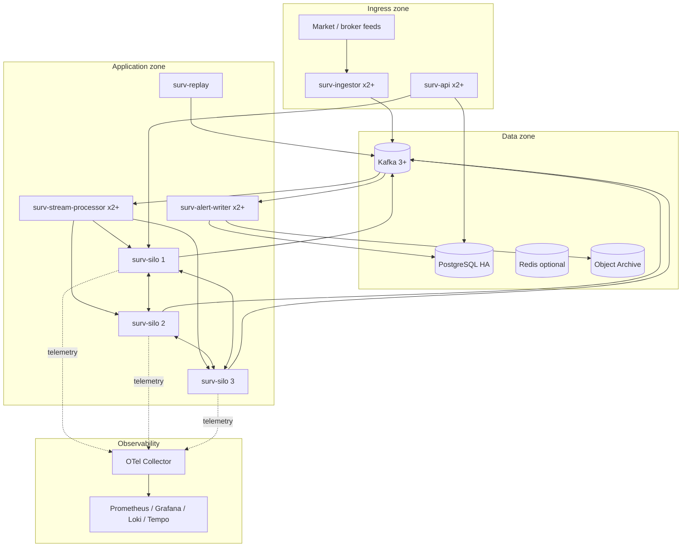

# Container Architecture

## Recommended application containers

Keep the application side to **six primary deployable services**. Add domain adapters only when their data is available.

| Service | Stateful? | Scale | Responsibility |
|---|---|---:|---|
| `surv-ingestor` | No | 2+ | Decode/validate feeds, normalize to canonical contracts, publish Kafka |
| `surv-stream-processor` | No | 2+ | Kafka consumer group; dispatch canonical events to the live Orleans cluster |
| `surv-silo` | Orleans state | 3+ | Grains, detectors, rule evaluation, alert correlation |
| `surv-alert-writer` | No | 2+ | Consume alerts and persist alerts/evidence metadata to PostgreSQL/archive |
| `surv-api` | No | 2+ | Query, rule administration, alert/case APIs; Orleans client for live snapshots when needed |
| `surv-replay` | No | 1+ | Controlled historical replay into the isolated replay cluster |

### Optional domain adapters

Only deploy when needed:

- `surv-refdata-adapter`
- `surv-client-order-adapter`
- `surv-short-settlement-adapter`
- `surv-seclending-adapter`
- `surv-routing-adapter`
- `surv-account-security-adapter`
- `surv-external-signal-adapter` (communications/news signal transport; AI interpretation is future scope)

## Infrastructure containers/services

- Kafka: production cluster, normally 3+ brokers
- PostgreSQL: HA primary/standby or managed equivalent
- Redis: optional cache/grain-directory/persistence provider where justified
- MinIO/S3-compatible object storage: immutable raw archive and large evidence artifacts
- OpenTelemetry Collector
- Prometheus
- Grafana
- Loki
- Tempo

## Option A — rules embedded in silos **(recommended)**

**Pros:** no per-rule network hop, local stateless-worker scaling, simple failure model, very low latency.

**Cons:** a rule-pack deployment/runtime bug is inside the surveillance process; mitigate through strict versioning, validation and shadow activation.

## Option B — separate rules microservice

**Pros:** independent deployment/governance; language/runtime isolation.

**Cons:** network latency, new bottleneck, more retries/idempotency, more failure modes. Do not choose this merely because "microservices" sounds cleaner.

## Option C — one giant application container

Acceptable for development only. It is simple, but replay, feed parsing and database persistence can starve the live surveillance loop.
