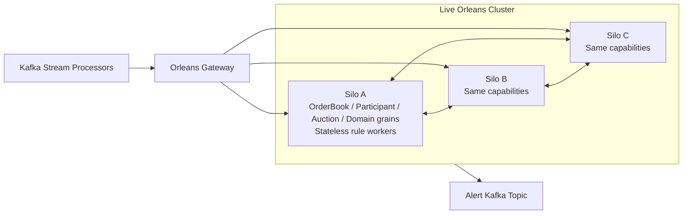
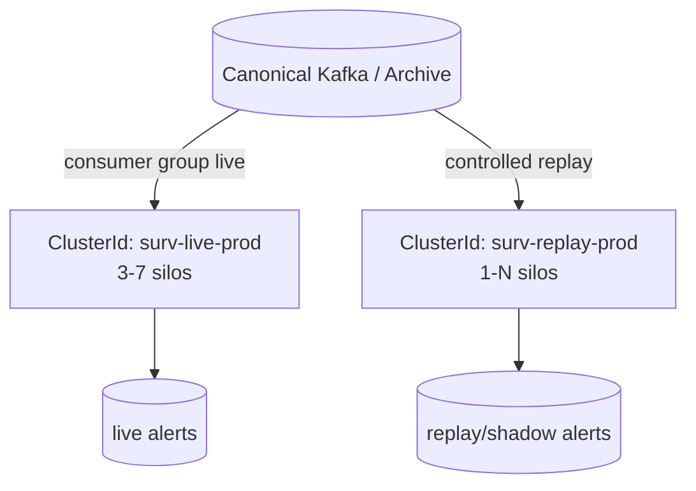

# Orleans Silo Architecture

## Live silo topology

Run **homogeneous silos** first: each `surv-silo` image contains the same grain implementations. Orleans can place activations across the cluster according to resource pressure.

## Minimum production cluster

- **3 silos**, on separate failure domains/VMs/nodes.
- Same `ServiceId`, same live `ClusterId`.
- Use PostgreSQL ADO.NET clustering for a straightforward on-prem durable membership table.
- Keep silo-to-silo traffic on the private application network.
- Use the Orleans gateway only for trusted internal clients (`surv-stream-processor`, `surv-api`).

## Grain placement

### Start with Orleans resource-optimized placement

Do not build custom placement on day one. Orleans 10 inherits the resource-aware placement behavior introduced in Orleans 9.2, balancing activations using CPU/memory signals.

### Hot-instrument exception

A highly active `OrderBookGrain` is intentionally single-owner because market-order sequence matters. If one instrument becomes CPU-hot:

1. Keep the authoritative order book single-owner.
2. Minimize work in that grain.
3. Pass compact immutable fact bundles to local stateless rule workers.
4. Shard secondary coordination/participant windows, not the authoritative book.
5. Only after measurement, consider placement constraints onto high-clock-speed silos.

## Reentrancy policy

**Default: no reentrancy for mutable financial state.**

Use non-reentrant grains for:

- OrderBookGrain
- ParticipantInstrumentGrain
- AuctionGrain
- PositionGrain
- ShortSettlementGrain
- AlertCorrelationGrain

Why: their main value is serialized state transitions.

Use `[ReadOnly]` on truly read-only query methods where useful.

Use `[StatelessWorker]` for CPU-bound/stateless rule-evaluation workers. Stateless workers can have multiple activations per silo and favor local execution.

Use `[Reentrant]` or `MayInterleave` only after a measured need and a dedicated correctness review. They are not a default optimization.

## Timers and reminders

- Do **not** create high-frequency durable reminders for every active grain.
- Rolling windows should update from event time and bounded ring buffers/deques.
- Grain timers are acceptable for low-cost local flush/cleanup work.
- Durable reminders are reserved for infrequent workflows which must survive activation loss, such as end-of-session housekeeping or scheduled rule lifecycle actions.

## Live vs replay clusters

Never share the same `ClusterId` between live and replay.
