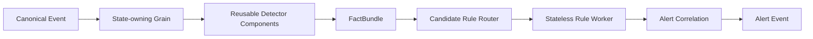

# Detection and Rules Engine

## The key separation



### Grains

Own mutable state and ordering.

### Detectors

Normal .NET services/classes. They calculate reusable facts such as cancellation ratio, price impact, participation, matching score, ownership relationship and cross-product benefit.

### Rules

Declarative policy over facts. They decide when a fact combination becomes a surveillance scenario.

## Do not evaluate 540 cases per event

Use **candidate routing**.

Examples:

- Order new/modify/cancel → spoof/layer, book pressure, probing, message-rate rule packs.
- Execution → wash/matched, price/volume, benchmark, coordination rule packs.
- Auction event → auction rule pack only.
- Corporate event → insider/event-driven rule packs.
- Borrow/settlement → short/settlement rule packs.
- Client-order event → front-running/routing rule packs.

A rule pack is selected by `FactType + MarketPhase + InstrumentProfile + AvailableDataDomains`.

## Recommended rule pack organization

Use the **22 implementation archetypes** as the first-level workflows, not 540 separate services.

Within a workflow, case-specific rules may share common detectors and threshold profiles.

Example:

```text
Workflow: SpoofLayer
  Rule: CASE-001 Spoofing
  Rule: CASE-002 Layering
  Rule: CASE-138 Spoof-and-Trade
  Rule: CASE-139 Layer-and-Trade
  ...
```

## Microsoft RulesEngine usage

- Store JSON/workflow definitions outside code.
- Load only active versions into a per-silo rule cache.
- Compile/initialize on version change, not per event.
- Inputs should be typed immutable fact objects.
- Restrict expressions to an allow-listed fact model and operators.
- Do not permit arbitrary user-provided CLR type access or custom code execution from the UI.

## Stateless rule workers

`RuleEvaluationWorkerGrain` is a `[StatelessWorker]` grain.

Why:

- evaluation has no durable identity;
- multiple local activations can absorb CPU load;
- Orleans can satisfy calls locally when possible;
- no global rules bottleneck.

## Alert output

Every alert must contain:

- `alertId`
- `caseId`
- `rulePack`
- `ruleVersion`
- `detectorVersion`
- `thresholdProfileVersion`
- `subjectIds`
- `instrumentIds`
- `windowStart/windowEnd`
- `score/severity`
- evidence summary
- source event ids / sequence range
- replay run id if replay

This makes an alert reproducible months later.
