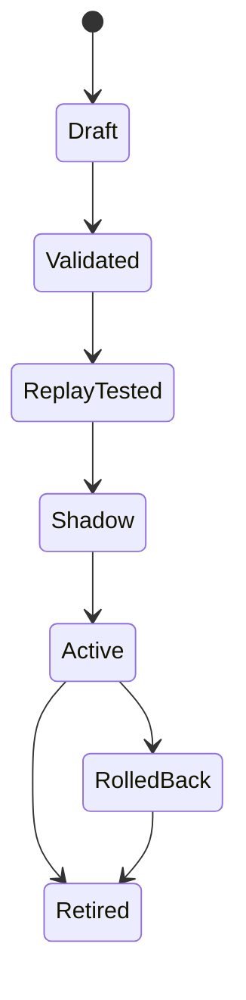

# Dynamic Rule Lifecycle

Dynamic must not mean uncontrolled.

## Rule states

## Rule record

Store in PostgreSQL:

- RulePackId
- RuleId / CaseId
- Semantic version
- JSON definition
- threshold profile references
- required fact types
- required data domains
- effective-from/effective-to
- author/reviewer
- approval status
- checksum
- test-run ids
- activation timestamp

## Activation flow

1. Author draft.
2. Static validation: schema, allowed fields/operators, no missing dependencies.
3. Unit scenario tests.
4. Historical replay.
5. False-positive review.
6. Shadow mode on live facts without investigator alerts.
7. Approve.
8. Publish `RulePackChanged` event.
9. Each silo builds the new immutable rule runtime and atomically swaps the active version.
10. Alerts stamp the exact version.

## Rollback

Never edit an active rule version in place. Activate the previous immutable version.

## Threshold profiles

Separate rule logic from calibration. A single rule can reference profiles by:

- liquidity bucket
- volatility regime
- continuous vs auction phase
- instrument class
- participant type

This prevents 540 rules from being copied only because thresholds differ.
