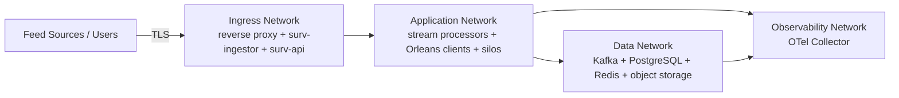

# Network Architecture

## Logical network zones

## Docker network suggestion

- `surv-ingress`: only services which must receive external connections.
- `surv-app`: internal application traffic and Orleans gateways/silos.
- `surv-data`: databases/brokers; `internal: true` where practical.
- `surv-observability`: OTLP/log/metrics path.

## Ports to plan

| Component | Typical port | Exposure |
|---|---:|---|
| HTTPS reverse proxy/API | 443 | approved user/client network |
| Orleans silo | 11111 | app network only |
| Orleans gateway | 30000 | app network only |
| Kafka | 9092 (or TLS listener) | app/data network only |
| PostgreSQL | 5432 | app/data network only |
| Redis | 6379 / TLS equivalent | app/data network only |
| OTLP gRPC | 4317 | observability internal |
| OTLP HTTP | 4318 | observability internal |
| Grafana | 3000 | admin/ops network only |

Orleans defaults commonly use 11111 for silo traffic and 30000 for gateway traffic; keep both private.

## Security rules

- No PostgreSQL/Kafka/Redis direct exposure to end users.
- Mutual TLS or network-level service identity for cross-host production traffic where feasible.
- Secrets come from environment/secret store, not images or committed Compose files.
- Separate live and replay Kafka credentials/ACLs.
- Replay cannot publish into live alert topics.
- Use firewall rules so only trusted Orleans clients can reach gateways.
