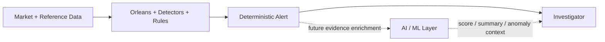

# AI Future Overview

AI is part of the final product, but **not part of the deterministic critical-path design in this implementation pack**.

## Future AI roles

AI can later sit beside the rule platform for:

- anomaly discovery outside known rules;
- communications/news/social text understanding;
- unknown relationship/coordination discovery;
- alert ranking and false-positive reduction;
- evidence summarization for investigators;
- natural-language investigation assistance.

## Boundary

The deterministic alert must still exist if AI is unavailable. AI should not be able to silently suppress a regulatory alert without an explicit governed policy.

No model selection, feature-store, vector database or AI deployment design is defined here yet.
