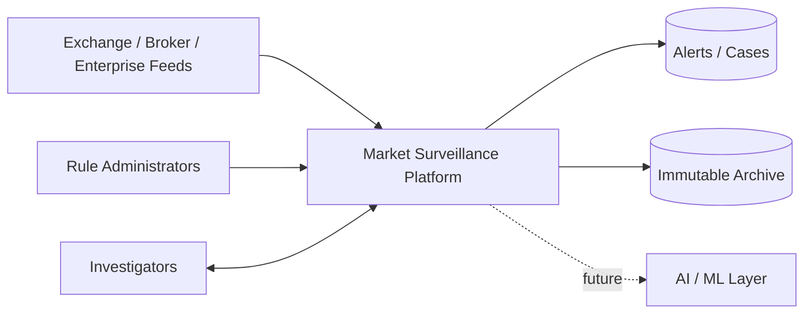

# Diagram — System Context

```mermaid
flowchart LR
  EX[Exchange / Broker / Enterprise Feeds] --> P[Market Surveillance Platform]
  ADM[Rule Administrators] --> P
  INV[Investigators] <--> P
  P --> DB[(Alerts / Cases)]
  P --> AR[(Immutable Archive)]
  P -. future .-> AI[AI / ML Layer]
```

The deterministic surveillance platform remains operational when the future AI layer is unavailable.
