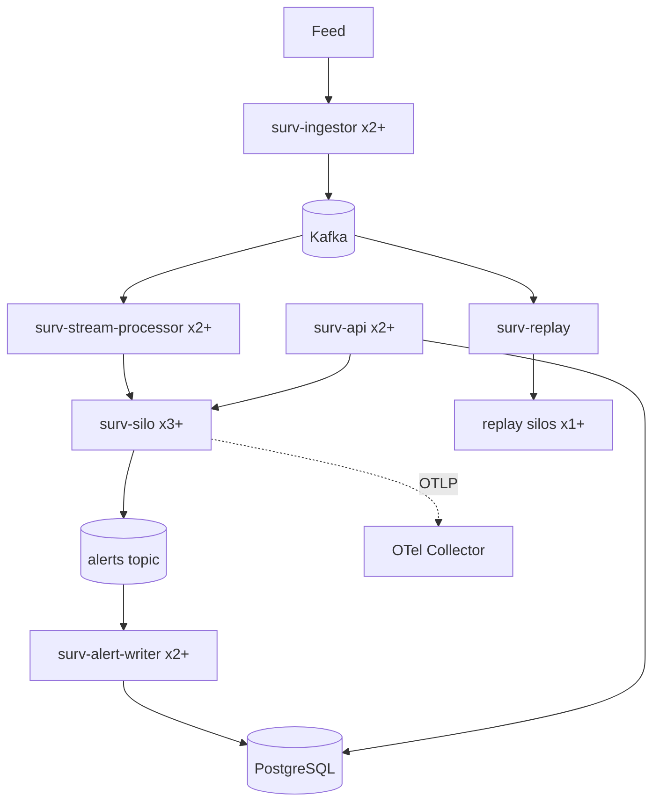

# Diagram — Container Topology

```mermaid
flowchart TB
  Feed --> Ingestor[surv-ingestor x2+] --> Kafka[(Kafka)]
  Kafka --> Stream[surv-stream-processor x2+]
  Stream --> Silos[surv-silo x3+]
  Silos --> AlertTopic[(alerts topic)]
  AlertTopic --> Writer[surv-alert-writer x2+] --> PG[(PostgreSQL)]
  API[surv-api x2+] --> PG
  API --> Silos
  Kafka --> Replay[surv-replay] --> ReplaySilos[replay silos x1+]
  Silos -. OTLP .-> OTel[OTel Collector]
```
