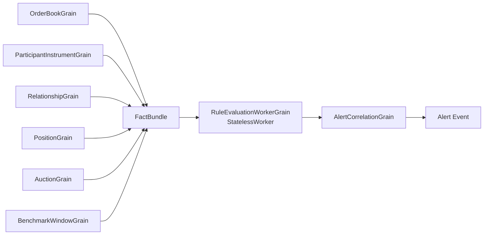

# Diagram — Grain Interaction

```mermaid
flowchart LR
  OB[OrderBookGrain] --> FB[FactBundle]
  PI[ParticipantInstrumentGrain] --> FB
  REL[RelationshipGrain] --> FB
  POS[PositionGrain] --> FB
  AU[AuctionGrain] --> FB
  BM[BenchmarkWindowGrain] --> FB
  FB --> RW[RuleEvaluationWorkerGrain\nStatelessWorker]
  RW --> AC[AlertCorrelationGrain]
  AC --> A[Alert Event]
```
