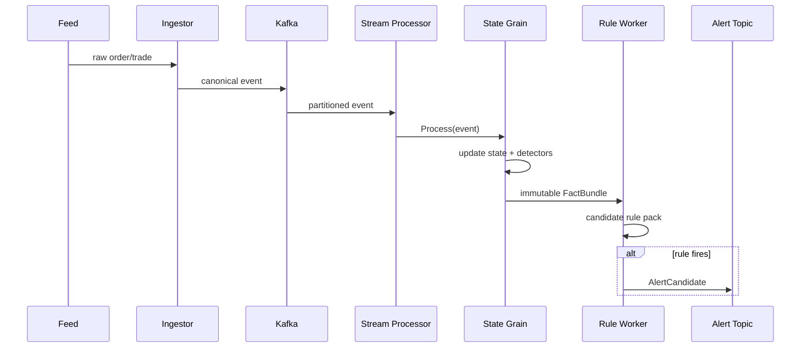

# Diagram — Live Event Sequence

```mermaid
sequenceDiagram
  participant F as Feed
  participant I as Ingestor
  participant K as Kafka
  participant S as Stream Processor
  participant O as State Grain
  participant R as Rule Worker
  participant A as Alert Topic

  F->>I: raw order/trade
  I->>K: canonical event
  K->>S: partitioned event
  S->>O: Process(event)
  O->>O: update state + detectors
  O->>R: immutable FactBundle
  R->>R: candidate rule pack
  alt rule fires
    R->>A: AlertCandidate
  end
```
