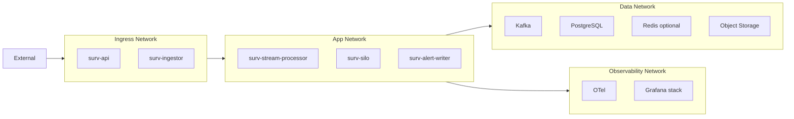

# Diagram — Docker Network Zones

```mermaid
flowchart LR
  U[External] --> IN[Ingress Network]
  IN --> AP[App Network]
  AP --> DA[Data Network]
  AP --> OB[Observability Network]

  subgraph IN[Ingress Network]
    API[surv-api]
    ING[surv-ingestor]
  end
  subgraph AP[App Network]
    SP[surv-stream-processor]
    SI[surv-silo]
    AW[surv-alert-writer]
  end
  subgraph DA[Data Network]
    K[Kafka]
    P[PostgreSQL]
    R[Redis optional]
    M[Object Storage]
  end
  subgraph OB[Observability Network]
    OT[OTel]
    GR[Grafana stack]
  end
```
