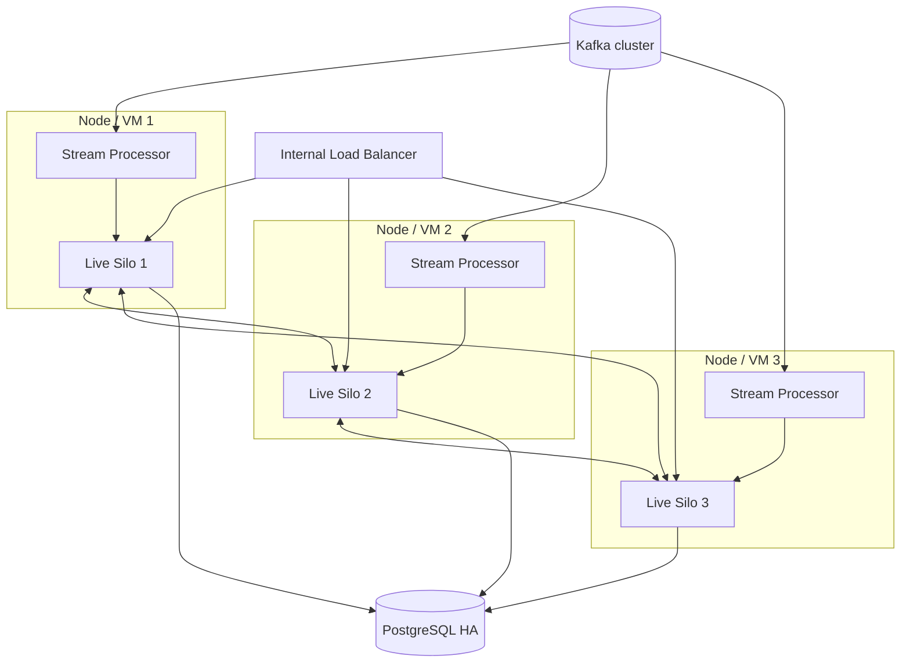

# Diagram — Three-Node Live Production Baseline

```mermaid
flowchart TB
  LB[Internal Load Balancer]
  subgraph N1[Node / VM 1]
    S1[Live Silo 1]
    P1[Stream Processor]
  end
  subgraph N2[Node / VM 2]
    S2[Live Silo 2]
    P2[Stream Processor]
  end
  subgraph N3[Node / VM 3]
    S3[Live Silo 3]
    P3[Stream Processor]
  end
  LB --> S1
  LB --> S2
  LB --> S3
  S1 <--> S2
  S2 <--> S3
  S1 <--> S3
  K[(Kafka cluster)] --> P1
  K --> P2
  K --> P3
  P1 --> S1
  P2 --> S2
  P3 --> S3
  S1 --> PG[(PostgreSQL HA)]
  S2 --> PG
  S3 --> PG
```

The exact processor-to-silo call can route to any grain activation; the diagram emphasizes failure-domain distribution, not fixed affinity.
