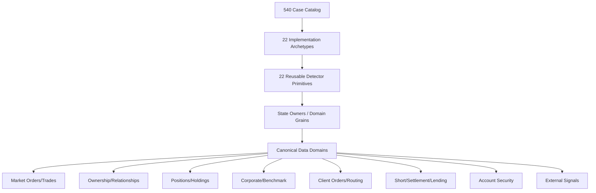

# Diagram — 540 Coverage Layers

```mermaid
flowchart TB
  C[540 Case Catalog] --> A[22 Implementation Archetypes]
  A --> D[22 Reusable Detector Primitives]
  D --> S[State Owners / Domain Grains]
  S --> E[Canonical Data Domains]

  E --> E1[Market Orders/Trades]
  E --> E2[Ownership/Relationships]
  E --> E3[Positions/Holdings]
  E --> E4[Corporate/Benchmark]
  E --> E5[Client Orders/Routing]
  E --> E6[Short/Settlement/Lending]
  E --> E7[Account Security]
  E --> E8[External Signals]
```

The system covers the catalog by composing shared state/detectors, not by implementing 540 independent streaming applications.
