# Current DROP System Map

```mermaid
flowchart TB
    H[[DROP-Current-System/00 - Current DROP System Home]]
    P[[DROP-Current-System/01 - DROP Protocol Overview]]
    M[[DROP-Current-System/02 - DROP Message Catalog]]
    A[[DROP-Current-System/03 - Current DROP Runtime Architecture]]
    E[[DROP-Current-System/04 - Entity and Identity Model]]
    D[[DROP-Current-System/05 - Business Data Dictionary and Join Keys]]
    I[[DROP-Current-System/06 - Surveillance Data Interface Boundary]]
    L[[DROP-Current-System/07 - Order and Transaction Lifecycle]]
    K[[DROP-Current-System/08 - Kafka Topic Catalog]]
    R[[DROP-Current-System/09 - Redis State and Reference Cache]]
    DB[[DROP-Current-System/10 - Persistence and Database Model]]
    AF[[DROP-Current-System/11 - Airflow Orchestration]]
    G[[DROP-Current-System/12 - Runtime Guarantees and Known Gaps]]
    HA[[DROP-Current-System/13 - Current Capacity HA and Deployment Baseline]]
    T[[DROP-Current-System/14 - Proposed DROP HA and Hardware Target]]
    S[[DROP-Current-System/15 - Source Classification and Reliability]]
    H --> P & M & A & E & D & I & L & K & R & DB & AF & G & HA & T & S
```

## Business path

[[DROP-Current-System/02 - DROP Message Catalog|Message catalog]] -> [[DROP-Current-System/04 - Entity and Identity Model|identity model]] -> [[DROP-Current-System/05 - Business Data Dictionary and Join Keys|join keys]] -> [[DROP-Current-System/06 - Surveillance Data Interface Boundary|surveillance input boundary]].

## Platform path

[[DROP-Current-System/03 - Current DROP Runtime Architecture|runtime architecture]] -> [[DROP-Current-System/08 - Kafka Topic Catalog|Kafka]] / [[DROP-Current-System/09 - Redis State and Reference Cache|Redis]] / [[DROP-Current-System/10 - Persistence and Database Model|DB]] -> [[DROP-Current-System/11 - Airflow Orchestration|Airflow]] -> [[DROP-Current-System/12 - Runtime Guarantees and Known Gaps|reliability gaps]].
