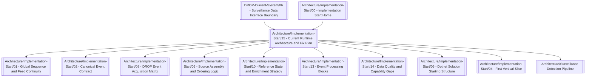

# Current THE EYE Architecture Map

> [!IMPORTANT]
> This is the graph entry for the current implementation architecture.



## Runtime path

```text
Existing MME/DROP
      ↓
TheEye.Ingestion
  + DropAdapters
  + SourceAssembly library
      ↓
surv.drop.canonical.v1
      ↓
TheEye.Silo
  + canonical consumer
  + reference/context projectors
  + Account → Investor resolution
  + trade pairing
  + keyed dispatcher
  + Orleans grains
  + detectors / RulesEngine
      ↓
Surveillance alerts
```

## Architecture rules

- SourceAssembly is inside the Ingestor deployable.
- Kafka is the hard boundary between Ingestor and Silo.
- The Silo does not consume the raw 37-topic DROP family for normal market/reference processing.
- The Ingestor canonicalizes source truth; it does not perform reference enrichment/trade pairing.
- Investor/Account are independent source reference events; Account → Investor resolution is Silo-side.
- At-least-once + deterministic `EventId` + idempotent replay is preferred over silent loss.
- Source offsets commit only across contiguous durable source records.
- Canonical Kafka begins with one ordered partition per `SequenceDomain`.
- Coverage gaps require safe-watermark proof.

## Start here

[[Architecture/Implementation-Start/15 - Current Runtime Architecture and Fix Plan|Current Runtime Architecture and Fix Plan]]
