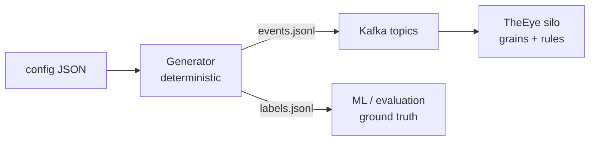

# Synthetic Data Home

TheEye's synthetic market-data generator. Lives in the code repo at
`the-eye-v2/TheEye.SyntheticData/` (project `TheEye.SyntheticData`, tests in
`TheEye.SyntheticDataTests`).

## What it is for

We need labeled fraud data to build and evaluate Circular Trading detection and,
later, the ML ranking layer. Real labeled fraud data does not exist yet, so we
**simulate** it: a realistic background market plus injected fraud episodes, each
carrying ground-truth labels kept strictly outside the event payloads.

The generator emits events in the **exact wire format** the logic layer consumes
(canonical `DropEventEnvelope` + bare `MatchedTradeEvent`), so a generated dataset
exercises the whole real pipeline — Kafka topics, mappers, grains, rules — with
zero glue code.

## The one mental model

> A dataset is a **simulated trading session**. The config says how busy the
> session is; scenarios decide which parts of it are fraudulent; labels record
> the answer key separately.

## What "one datapoint" means (three answers)

| Framings | Count in the training profile | What it is used for |
|---|---|---|
| **Labeled episode** | 600 (300 fraud / 300 hard negative) | The supervised unit — one row for the future ranker |
| **Matched trade** | 19,807 | Feature-extraction input (trade graph edges) |
| **Wire event** | 152,593 | Raw Kafka records consumed by the silo |

| Doc | Answers |
|---|---|
| [[01 - Quick Start - Generate and Publish]] | How do I run it? Where do files land? |
| [[02 - Output Files]] | What exactly is inside events/labels/manifest/config? |
| [[03 - Controlling the Distribution]] | How do I shape quantities, timing, prices, fraud mix? |
| [[04 - How Generation Works - Code Walkthrough]] | How does the code actually produce all this? |
| [[05 - Circular Trading Scenario]] | What do Easy/Medium/Hard/hard-negative episodes look like? |
| [[09 - Spoofing Scenario]] | Same question for spoofing walls + hard negatives |
| [[06 - Determinism and Scale]] | Why is it byte-reproducible? How big can it get? |
| [[07 - Adding a New Scenario]] | How do I add the next fraud case? |
| [[08 - Hardening Roadmap]] | How do we keep making the data harder to cheat — and what is the adversarial loop? |

## Key facts (memorize these)

- **Deterministic**: same `seed` + `runId` + config → byte-identical `events.jsonl`.
- **Output** lives under `artifacts/synthetic/<runId>/` in the repo by default — never committed to git.
- **Labels never leak** into Kafka payloads (a test enforces this).
- **No config caps** on size; the practical limit is machine RAM (~10M events per run on a 16 GB machine), and unlimited across runs by varying `seed`.
- **Two fraud cases implemented** (`circular-trading`, `spoofing`); new cases plug in via `ISyntheticScenario` — see [[07 - Adding a New Scenario]].

## Hardened against fingerprinting

Normal flow also contains: related-account (intra-firm) trading, block sizes,
partial fills, price jumps, activity bursts — and positives include 2-account
ping-pong rings. No single feature cleanly separates fraud from normal; 8
tests in `HardeningTests` enforce it. Details: [[08 - Hardening Roadmap]].

## Related vault notes

- [[Architecture/Implementation-Start/00 - Implementation Start Home|Implementation Start Home]] — the engineering baseline this serves
- [[Cases/CASE-006|CASE-006]] — Circular Trading case definition
- `the-eye-v2/docs/smoke-testing.md` (repo) — Mode D: replaying synthetic data through Kafka
