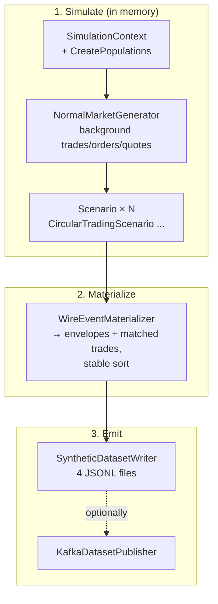

# How Generation Works - Code Walkthrough

The whole generator is ~10 small classes in `TheEye.SyntheticData/`. One pass,
no agents, no loops — a straight simulation that ends with sorted output files.

## The pipeline

## File map

| File | Role |
|---|---|
| `Program.cs` | CLI (`generate` / `publish`), arg parsing, defaults |
| `SyntheticDatasetConfig.cs` | All config records + `Validate()` — the knobs of [[03 - Controlling the Distribution]] |
| `DeterministicRandom.cs` | SplitMix64 RNG + `Fork(scope)` |
| `SimulationContext.cs` | Shared simulation state: populations, id allocators, reference prices, trade/resting/quote/label lists |
| `NormalMarketGenerator.cs` | The background market |
| `CircularTradingScenario.cs` | Fraud + lookalike episodes ([[05 - Circular Trading Scenario]]) |
| `ISyntheticScenario.cs` | Scenario contract + registry ([[07 - Adding a New Scenario]]) |
| `WireEventMaterializer.cs` | Simulation → wire contracts, deterministic ordering |
| `SyntheticDatasetWriter.cs` | The four output files |
| `KafkaDatasetPublisher.cs` | Streams `events.jsonl` to the two topics |

## Stage 1 — `SimulationContext`

Owns everything the simulation accumulates:

- **Populations** — per book, `participantCount` traders, first
  `marketMakerCount` flagged as market makers. Each gets a lognormal
  `ActivityWeight` (drives weighted counterparty selection) and a **unique
  account** — one account per participant, so "same account both sides" can
  never happen accidentally (`AddTrade` throws on it).
- **Id allocators** — monotonic counters for match ids (from 10,000,000), order
  ids (from 100,000,000), participant/account/episode ids. Because allocation
  order is deterministic, ids are deterministic.
- **Reference prices** — a time series of mid prices per book
  (`RecordReferencePrice`), binary-searchable by time (`ReferencePriceAt`).
  Scenarios use it to price their trades near the *background* market, not at
  arbitrary prices.

## Stage 2 — `NormalMarketGenerator`

Per book, with its own RNG fork `normal:{bookId}`:

1. **Trade times** — `tradesPerBook` timestamps, U-shaped
   (`edgeSessionTradeFraction` → quadratic concentration at session edges).
2. **Per trade**: step the mid price (mean-reverting walk) → derive best
   bid/offer around it (`typicalSpreadTicks ± 1`) → pick the aggressor side →
   trade price = opposite best quote → sample quantity (lognormal, lot-rounded)
   → pick counterparties (market maker takes a side with
   `marketMakerParticipation` probability, else two weighted picks with
   distinct accounts) → `context.AddTrade(...)`.
3. Every `bboEveryTrades` trades, emit a `SyntheticQuote`.
4. **Resting orders** — `trades × restingOrdersPerTrade` of them (randomized
   rounding for fractional values): random owner/side, 1–7 ticks off the
   *reference price at creation time*, lognormal lifetime clamped 3–300 s,
   optional ±1-tick modify at half-life. Each becomes a
   new / (modify) / cancel sequence later.

Everything so far is **simulation state** (trades, resting orders, quotes) —
not yet wire events.

## Stage 3 — Scenarios

Each `scenarios[]` entry is dispatched by type to a registered
`ISyntheticScenario`, which reads its own options block and pushes **more
simulation state** (trades, account groups, labels) through the same
`SimulationContext` APIs. Fraud trades therefore flow through the exact same
materialization as normal trades — no way to tell them apart from the wire
format alone. That is the point.

## Stage 4 — `WireEventMaterializer`

Converts simulation state → wire records:

- **Per trade**: 4 `OrderLifecycleEvent`s (buy N, sell N, buy E, sell E with
  DROP `changeReason`/`orderStatus` semantics) + 1 bare `MatchedTradeEvent`
  whose evidence links the two execute event ids and the coverage epoch.
- **Per resting order**: N (+ M?) + C lifecycle events.
- **Per quote**: 1 `BestBidOfferEvent`. **Per account group**: 1
  `AccountGroupReferenceEvent`.
- **Event ids**: `syn-{runToken}-{stable identity}` (e.g. `o{orderId}-n`) —
  identity is content-derived, so ids are stable across regenerations.
- **Ordering**: sort by event time, then a fixed sort priority
  (account groups 0 → quotes 10 → new 20 → modify 30 → custom 40 → execute 50
  → cancel 60), then stable sequence — ties break identically every run. This
  matters because equal timestamps are common and the silo must see N before E.

## Stage 5 — Writer / Publisher

- `SyntheticDatasetWriter` streams the sorted records to `events.jsonl` /
  `labels.jsonl` (one JSON per line) and pretty-prints `manifest.json` +
  `config.json`. Refuses to clobber an existing dataset without `--force`.
- `KafkaDatasetPublisher` reads `events.jsonl` line by line, routes by shape
  (`eventType` present → canonical topic; `matchId` present → trades topic),
  optionally pacing by event-time difference (`--speed`).

## Why it's deterministic (short version)

- One root RNG from `seed`; every consumer forks a **named sub-stream**
  (`Fork("normal:101")`, `Fork("positive:7")`) — reordering or adding one
  consumer never disturbs another's random sequence.
- SplitMix64 instead of `System.Random` — identical results across .NET
  versions.
- All ordering is by explicit comparators, never by hash iteration.
- Tests re-generate twice and assert byte-identical `events.jsonl`.
  Details: [[06 - Determinism and Scale]].
