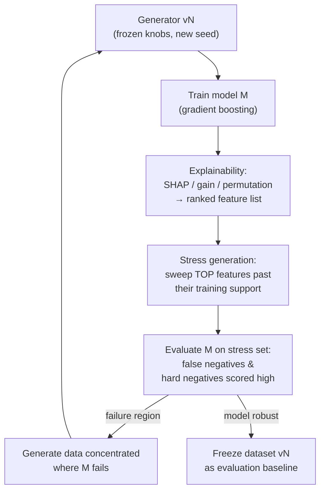

# Hardening Roadmap

How to make the synthetic dataset progressively harder to "cheat" — and the
adversarial loop that turns a trained model's own explainability into the next
generation of harder data.

## Level 0 — Already hardened (in the generator now)

Every change below removes a feature that *perfectly separated* fraud from
normal flow, so any model must combine weak signals instead of keying on one:

| Generator artifact (before) | Hardening (now) | Config knob (default) |
|---|---|---|
| Account groups existed **only on fraud rings** | Benign firm/desk groups in normal flow, emitted as real `AccountGroupReferenceEvent`s | `benignAccountGroupFraction` (0.15) |
| Group members never traded each other — "counterparties share a group" was a near-perfect label leak | **Intra-firm crossing**: a share of normal trades is two accounts of the same benign group trading | `intraGroupTradeFraction` (0.10) |
| Fraud lead times sat in a fraud-only band (0.25–4 s) disjoint from normal (50–1500 ms) | Scenarios draw leads from the **same samplers** as normal flow | — (shared `SampleAggressiveLead/PassiveLead`) |
| Every trade = exactly 4 lifecycle events | **Partial fills**: one order pair fills 2–3× — per-transaction `matchedQuantity`, `leavesQuantity` shrinking to zero, `orderStatus` 1 until the final fill (DROP Order [1] semantics) | `partialFillProbability` (0.10) |
| Quantities clamped at 12× typical — "huge order" = fraud | **Block trades** in normal flow up to 60× typical | `blockTradeProbability` (0.008) |
| Gaussian ±6-tick steps only — no gaps, no vol memory | **Price jumps** (10–50 ticks) + **volatility clustering** (AR(1) log-vol state) | `priceJumpProbability` (0.004) |
| Smooth U-shaped arrivals | **Activity clustering**: minute-level intensity bursts/lulls (AR(1) lognormal) over the U-shape | `activityClusteringStrength` (0.5) |
| Rings were always ≥3 accounts | **Ping-pong** difficulty: 2-account wash rings, 3–6 repetitions | `pingPongFraction` in scenario options (0.0 default; training profile 0.15) |

`TheEye.SyntheticDataTests/HardeningTests.cs` (8 tests) locks these in — e.g.
it measures the actual same-group trade rate in normal flow (~10%) against the
fraud rate (~50%) and fails if either collapses to a clean separator.

## Level 1 — The adversarial loop (the main event)

The core idea: **the dataset is not a static artifact; it is a sparring partner
that learns from the model's failures.** Every round:

Round by round:

1. **Train.** Extract per-episode features (trade-graph features + the
   intended-signal analogues a detector could actually compute: cycle
   structure, quantity-return ratios, timing regularity, group overlap).
   Train a gradient-boosted ranker/classifier on a balanced training split.
2. **Explain.** Compute feature attributions (SHAP values, gain importance,
   permutation importance). The top-5 list is *exactly where the model's
   attention lives* — and therefore where the next attack goes.
3. **Stress.** For each top feature, generate a **stress set** sweeping that
   feature *outside its training support*: if `meanQuantityReturnRatio` ranks
   first, generate positives with 0.30–0.55 returns (below today's Hard floor).
   If cycle duration ranks first, generate multi-hour, sparse cycles. If
   group-overlap ranks first, generate positives with zero related accounts
   (already partially Hard's job).
4. **Evaluate.** Run the frozen model on the stress set. Two failure modes:
   - **False negatives**: real-looking fraud that slips under the score
     threshold — the generation direction to push.
   - **False positives**: hard negatives now scored high — the model's
     "fraud signature" is too generator-specific.
5. **Targeted generation.** Generate the next training batch with density
   shifted toward the failure region (sweep the *same* difficulty knobs that
   produced the failures, wider). Retrain. Repeat.
6. **Freeze periodically.** When a round produces no new failures, freeze that
   dataset version as an evaluation baseline and bump difficulty — the Hard
   profile's parameters should be re-baselined against the *current* detector,
   not the original hand-picked values.

### Guardrails (what keeps the loop honest)

- **Run the domain-classifier audit every round** (Level 2 below): if a trivial
  classifier separates synthetic-normal from synthetic-fraud with ~100% AUC,
  the model is learning the generator fingerprint, not fraud. Fix the
  generator before generating "harder" data.
- **Hold out generator versions**: if a model trained on vN scores 100% on vN
  but drops 30 points on vN−1, it overfit the version's quirks.
- **Keep a prevalence-realistic eval set** (~fraud is 1-in-10⁴–10⁵ trades);
  balanced sets hide precision collapse. Report PR curves, never accuracy.
- **Hard negatives ratchet too**: every new fraud capability must gain a
  lookalike variant, or the loop just teaches the model "anything extreme =
  fraud."

### Why this works

Feature explainability converts an opaque failure ("recall dropped") into a
*coordinate in feature space* ("fails when return ratio < 0.5 AND duration >
40 min"). Generation knobs are the same coordinates. The loop is coordinate
descent — model descends on fraud detectability, generator descends on model
robustness.

## Level 2 — Domain-classifier audit (build next)

Train a small GBM to distinguish **synthetic-normal vs real-normal** events
(feature-importance output = realism gap list), plus synthetic-normal vs
synthetic-fraud (output = fingerprint list). Automate both as CI checks. Known
remaining gaps to close with it:

- Round-number order-size clustering (100/500/1000 lots) — real, absent here.
- Concave depth profiles and distance-dependent cancel intensity.
- Persistent counterparty relationships (repeat trading pairs) — flow is
  memoryless today.
- Order-book-aware trade pricing (trades always exactly at best bid/offer;
  real trades can be inside the spread).
- Partial episodes: rings caught mid-cycle, participant dropout, interleaved
  legitimate hedges inside a wash sequence.
- Cross-case contamination: spoofing + circular in one window.

## Level 3 — Real-data calibration (when DROP access lands)

- Calibrate every distribution knob against real EGX per-instrument statistics
  (replace placeholder tick sizes, vol, volume profiles).
- Shadow-mode the detector + model on the live feed; analysts label top-K and
  random-K alerts; real labels retrain and re-baseline difficulty. Synthetic
  stays the cold-start and the negative-mine; real labels are the endgame.

## Priority order (my recommendation)

1. Build the stress-set/eval harness (Level 1 steps 1–4) — it's pure
   tooling over the existing generator, no generator changes.
2. Domain-classifier audit as a CI check (Level 2).
3. Close Level 2 gaps one audit finding at a time.
4. First re-baseline of Hard difficulty against a trained model.
